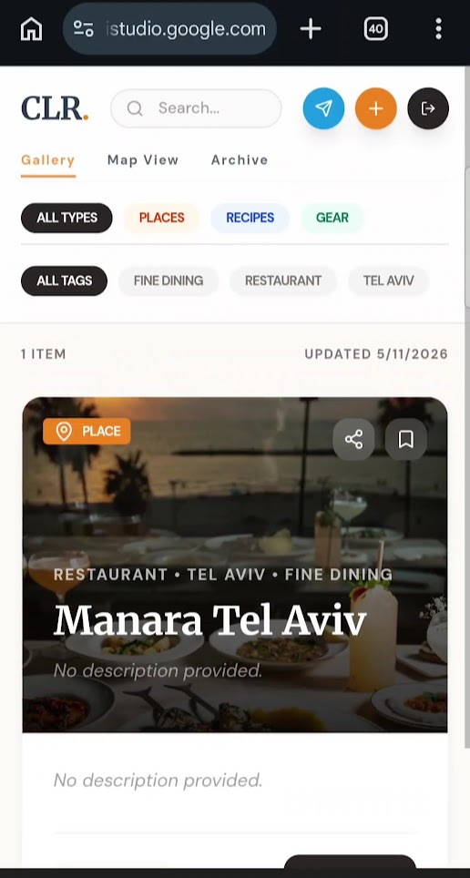
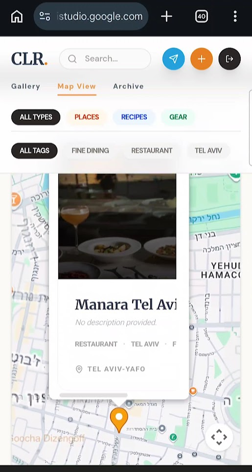
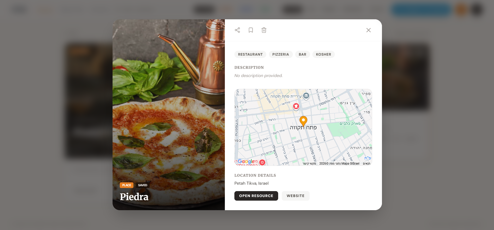
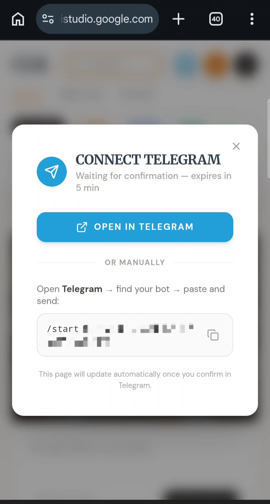
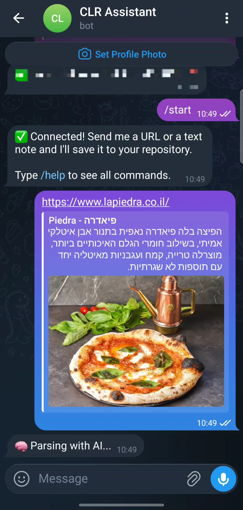
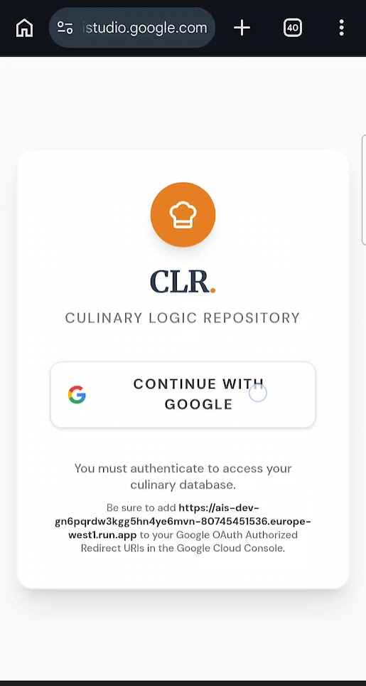

# Culinary Logic Repository (CLR)

Culinary Logic Repository (CLR) is a smart, centralized hub for curating, organizing, and exploring your favorite culinary discoveries. Whether it's a buzzing new restaurant, an unforgettable recipe, or highly recommended kitchen gear, CLR helps you capture and structure this information effortlessly.

## 🌟 Features

- **Smart LLM Ingestion**: Paste a URL or rough text, and CLR automatically extracts structured metadata (title, location, vibe, ingredients, pros/cons) using an advanced LLM pipeline.
- **Categorization**: Items are neatly categorized into:
  - 🍽️ **Places**: Restaurants, cafes, and bars with detailed info like cuisines, vibes, best for, and opening hours.
  - 📖 **Recipes**: Total time, difficulty, ingredients, and key techniques.
  - 🔪 **Gear**: Brand, category, price, pros, and cons.
- **Beautiful & Responsive UI**: Built with React and Tailwind CSS, featuring masonry grid layouts, filter tags, and rich item detail modals.
- **Telegram Bot Integration**: Seamlessly ingest links and discoveries on the go by sending them to the CLR Telegram bot.
- **Image Fallbacks**: Robust image fallback mechanisms using Unsplash & Google Places to ensure beautiful visuals when OpenGraph scraping fails.

## 📸 Screenshots

### Main Dashboard Grid

*A masonry grid view of all curated places, recipes, and gear, filterable by contextual tags.*

### Map View

*Interactive map view to explore places spatially.*

### Item Details Modal

*Detailed view showing rich context, tags, photo gallery, and specific attributes.*

### Telegram Bot Integration

*Connect your account to the companion Telegram bot.*


*Seamlessly ingest links and discoveries on the go via Telegram.*

### Log In

*User authentication experience.*

## 🚀 Tech Stack

- **Frontend**: React, Vite, Tailwind CSS, pre-built components (Lucide React & Framer Motion).
- **Backend (Python)**: Flask/Gunicorn python ingestion engine using BeautifulSoup for scraping and the Groq LLM API for advanced text extraction. 
- **Database**: Supabase (PostgreSQL) for remote data storage.
- **APIs**: 
  - Google Places API (Geocoding & Photos)
  - Groq API (LLM Extraction)
  - Telegram Bot API
  - Unsplash Source (Fallback Photography)

## 🛠️ Setup & Installation

1. Copy `.env.example` to `.env` and fill out your secrets (Supabase, Groq API, Google Maps Platform).
2. Install frontend dependencies:
   ```bash
   npm install
   ```
3. Run the frontend development server:
   ```bash
   npm run dev
   ```
4. Run the Python backend:
   ```bash
   cd backend
   pip install -r requirements.txt
   flask run
   ```

## 🤝 Contributing

Contributions, issues, and feature requests are welcome!
